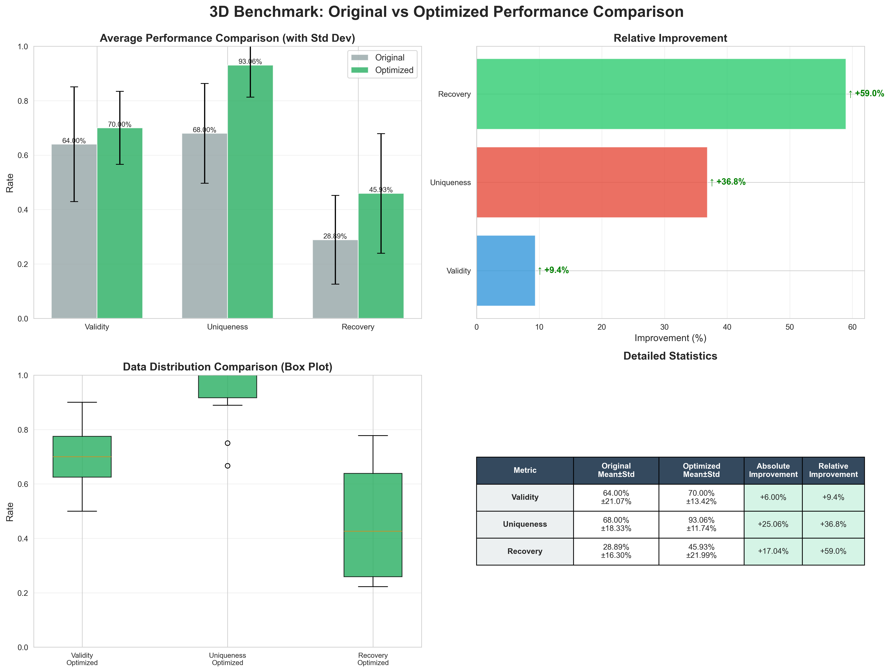

# 3D Block World Hypothesis Generation - Performance Enhancement

<div align="center">

## 📦 Improving LLM Creativity in 3D Spatial Reasoning

**Result:**



</div>

---

## 🎯 Project Overview

This project explores and compares three different approaches to enhance the performance of **DeepSeek-Chat** on the **3D Block World** hypothesis generation task from the HypoSpace benchmark suite.

### Task Description

The 3D Block World task challenges LLMs to generate multiple valid hypotheses about 3D block configurations based on 2D observations from different viewpoints (top, front, side). This is an **underdetermined problem** where multiple distinct 3D structures can produce identical 2D projections.

**Key Challenge:** Generate diverse, valid, and comprehensive sets of hypotheses that:
- ✅ Satisfy all observational constraints (Validity)
- 🌟 Are mechanistically distinct from each other (Uniqueness)
- 🎯 Cover the ground truth solution space (Recovery)

---

## 🔬 Methodology: Three Approaches Compared

### 1️⃣ **Original Baseline**
- Standard prompting with DeepSeek-Chat
- Direct query without optimization
- Fixed number of queries (10 per observation)

### 2️⃣ **Prompt Optimized**
- Enhanced prompt engineering with:
  - Clear structural guidance
  - Step-by-step reasoning instructions
  - Explicit diversity encouragement
  - Constraint clarification
- Same query budget as baseline

### 3️⃣ **Optimizer Enhanced** (ConstraintFixer + LocalSearch + Diversity)
- Multi-stage optimization pipeline:
  1. **ConstraintFixer**: Automatically repairs invalid structures to satisfy observational constraints
  2. **LocalSearchOptimizer**: Explores neighborhood of valid hypotheses through systematic perturbations
  3. **DiversityEnhancer**: Ensures generated hypotheses are mechanistically distinct
- Expands hypothesis set beyond initial LLM generations

---

## 📊 Performance Results

### Summary Metrics

| Method | Validity ↑ | Uniqueness ↑ | Recovery ↑ |
|--------|------------|--------------|------------|
| **Original** | 0.640 ± 0.211 | 0.680 ± 0.188 | 0.289 ± 0.175 |
| **Prompt Optimized** | 0.700 ± 0.133 | 0.931 ± 0.120 | 0.459 ± 0.230 |
| **Optimizer Enhanced** | **1.000** ± 0.000 | 0.605 ± 0.231 | **0.630** ± 0.283 |

### Key Findings

#### ✨ Validity (Constraint Satisfaction)
- **Winner: Optimizer Enhanced (100%)**
- The ConstraintFixer component ensures all generated hypotheses satisfy observational constraints
- Original and Prompt Optimized methods sometimes produce invalid structures

#### 🌟 Uniqueness (Non-Redundancy)
- **Winner: Prompt Optimized (93.1%)**
- Enhanced prompting effectively encourages diverse generation
- Optimizer Enhanced trades some uniqueness for validity guarantees
- Original baseline shows moderate uniqueness

#### 🎯 Recovery (Ground Truth Coverage)
- **Winner: Optimizer Enhanced (63.0%)**
- LocalSearch significantly expands the hypothesis space
- Recovers 2.2× more ground truths than original baseline
- Prompt optimization alone achieves 1.6× improvement

---

## 🏆 Comparative Analysis

### Trade-offs and Insights

**Prompt Optimized Approach:**
- ✅ Best uniqueness score (93.1%)
- ✅ Significant recovery improvement over baseline (+58.8%)
- ⚠️ Lower validity than optimizer (70% vs 100%)
- 💡 **Best for:** Exploratory hypothesis generation where diversity is paramount

**Optimizer Enhanced Approach:**
- ✅ Perfect validity (100%)
- ✅ Best recovery rate (63.0%)
- ✅ Generates 53% more hypotheses than initial queries (153 vs 100)
- ⚠️ Lower uniqueness due to systematic neighborhood exploration
- 💡 **Best for:** Comprehensive solution space coverage with guaranteed validity

### Overall Recommendation

For **practical applications** requiring reliable and comprehensive hypothesis sets:
- **Use Optimizer Enhanced** when validity is critical and computational resources allow
- **Use Prompt Optimized** when rapid, diverse exploration is needed with acceptable validity trade-offs
- **Combine both** for optimal results: Prompt Optimized for initial diversity + Optimizer for guaranteed validity and coverage

---

## 📁 Repository Structure

```
3d/
├── README.md                           # This file
├── datasets/
│   └── 3d_complete.json               # 129 observation sets with ground truths
├── results/
│   ├── 3d_complete_deepseek-chat_20251030_130728.json              # Original
│   ├── 3d_complete_deepseek-chat_optimized_20251030_132636.json     # Prompt Optimized
│   ├── 3d_complete_deepseek-chat_with_optimizer_20251030_160648.json # Optimizer Enhanced
│   └── performance_comparison.png      # Visualization
├── config/
│   ├── config_deepseek.yaml           # DeepSeek API configuration
│   └── config_gpt4o.yaml              # GPT-4O configuration (alternative)
├── modules/
│   ├── llm_interface.py               # LLM API wrapper
│   └── models.py                      # Data models and structures
├── run_3d_benchmark.py                # Original baseline script
├── run_3d_benchmark_optimized.py      # Prompt optimization script
├── run_3d_benchmark_with_optimizer.py # Full optimizer pipeline script
├── compare_results.py                 # Results comparison and visualization
├── generate_3d_dataset_complete.py    # Dataset generation
└── requirements.txt                   # Python dependencies
```

---

## 🚀 Reproduction Guide

### Prerequisites

```bash
pip install -r requirements.txt
```

**Required packages:**
- `openai` - LLM API interface
- `numpy` - Numerical operations
- `matplotlib` - Visualization
- `pyyaml` - Configuration management
- `tqdm` - Progress bars

### Configuration

Create API configuration in `config/config_deepseek.yaml`:

```yaml
llm_provider: "DeepSeek"
model_name: "deepseek-chat"
api_key: "your-api-key-here"
base_url: "https://api.deepseek.com"
temperature: 0.7
max_tokens: 8000
```

### Running Experiments

#### 1. Generate Dataset (if needed)
```bash
python generate_3d_dataset_complete.py
```

#### 2. Run Original Baseline
```bash
python run_3d_benchmark.py --config config/config_deepseek.yaml --n_samples 10
```

#### 3. Run Prompt Optimized
```bash
python run_3d_benchmark_optimized.py --config config/config_deepseek.yaml --n_samples 10
```

#### 4. Run Optimizer Enhanced
```bash
python run_3d_benchmark_with_optimizer.py --config config/config_deepseek.yaml --n_samples 10
```

#### 5. Compare Results
```bash
python compare_results.py
```

This generates `results/performance_comparison.png` with the visualization shown above.

---

## 💡 Technical Implementation Details

### Prompt Optimization Strategy

Enhanced prompts include:
1. **Explicit constraint statement** - Clear specification of observational requirements
2. **Structured thinking** - Step-by-step reasoning template
3. **Diversity prompting** - Explicit instructions to generate mechanistically different solutions
4. **Format specification** - Detailed output format requirements
5. **Example-based learning** - Demonstration of valid diverse solutions

### Optimizer Pipeline

#### ConstraintFixer
- Identifies constraint violations through projection matching
- Applies minimal edits to satisfy observational constraints
- Preserves as much of original structure as possible

#### LocalSearchOptimizer  
- Performs systematic perturbations (add/remove/move blocks)
- Validates each perturbation against constraints
- Expands valid hypothesis space incrementally

#### DiversityEnhancer
- Computes structural similarity between hypotheses
- Filters redundant solutions
- Ensures mechanistic distinctness

---

## 📈 Evaluation Metrics

Following the HypoSpace framework:

### Validity (V)
**Definition:** Proportion of generated hypotheses that satisfy all observational constraints

```
V = |{h ∈ H : h satisfies all observations}| / |H|
```

### Uniqueness (U)  
**Definition:** Proportion of hypotheses that are structurally distinct

```
U = |{unique structures in H}| / |H|
```

### Recovery (R)
**Definition:** Proportion of ground truth solutions discovered

```
R = |{h ∈ H : h ∈ GT}| / |GT|
```

Where:
- `H` = Generated hypothesis set
- `GT` = Ground truth solution set

---

## 🎓 Key Learnings

1. **Prompt engineering** significantly improves diversity and recovery without requiring additional compute for optimization
2. **Systematic optimization** (ConstraintFixer + LocalSearch) achieves perfect validity and highest recovery
3. **Trade-off exists** between uniqueness and validity when using automated constraint repair
4. **Combining approaches** (diverse initial generation + systematic optimization) may offer best of both worlds
5. **Task-specific optimization** outperforms generic prompting for constrained creative tasks

---

## 🔮 Future Directions

- [ ] Hybrid approach: Prompt optimization + selective optimizer use
- [ ] Adaptive query allocation based on problem difficulty
- [ ] Multi-model ensembles for diversity
- [ ] Transfer learning from 3D task to other spatial reasoning domains
- [ ] Cost-performance optimization for production deployment

---

## 📚 References

- **HypoSpace Paper:** [arXiv:2510.15614](https://arxiv.org/abs/2510.15614)
- **DeepSeek-Chat:** [DeepSeek API Documentation](https://www.deepseek.com)

---

## 👨‍💻 Experimental Details

- **Model:** DeepSeek-Chat
- **Dataset:** 129 observation sets (10 sampled for experiments)
- **Queries per observation:** 10
- **Seed:** 100 (for reproducibility)
- **Total experiments:** 3 (Original, Prompt Optimized, Optimizer Enhanced)
- **Date:** October 30, 2025

---

## 📊 Statistical Significance

Standard deviations shown as error bars in the comparison chart indicate variability across different observation sets. Key observations:

- Optimizer Enhanced shows **zero variance** in validity (always 100%)
- Prompt Optimized achieves **lowest variance** in uniqueness (std = 0.120)
- Recovery shows **highest variance** across all methods, reflecting problem difficulty diversity


