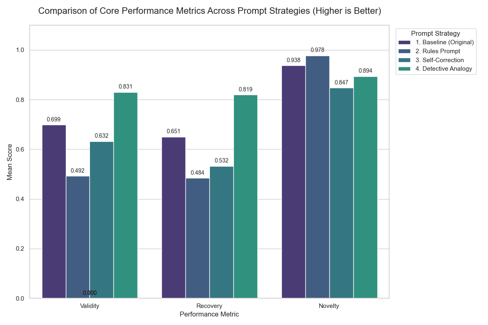
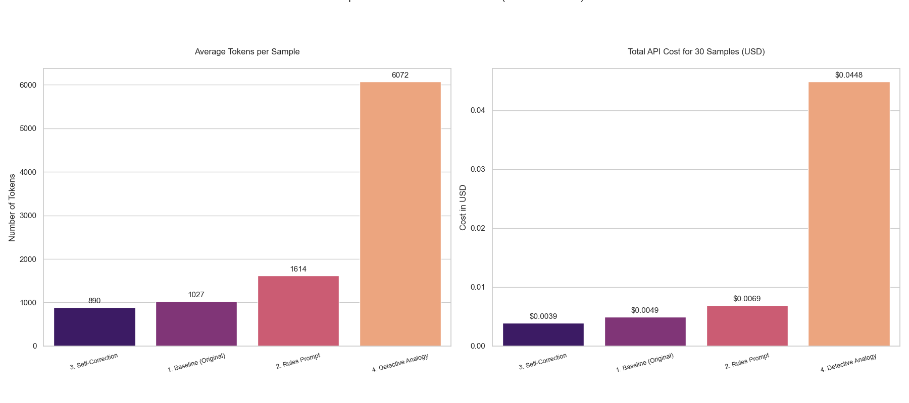

# Optimizing LLM Performance on Causal Graph Discovery

This document details a series of experiments aimed at improving the performance of the `deepseek-chat` model on the causal graph discovery task from the HypoSpace benchmark. The goal was to enhance three key creativity metrics: **Validity**, **Recovery**, and **Novelty**.

## Experimental Methodology

An iterative, experimental approach was used, centered on **Prompt Engineering**. Four distinct prompt strategies were systematically tested against a baseline dataset. Each experiment was run with the same configuration (`n_samples=30`, `seed=33550336`, `temperature=0.7`) to ensure a fair comparison.

The four strategies were:
1.  **Baseline (Original)**: A simple and direct prompt providing the core task instructions.
2.  **Rules Prompt**: A prompt that pre-processes observations into a list of explicit path constraints for the model to follow.
3.  **Self-Correction Prompt**: A prompt that encourages the model to use its own reasoning (`think step-by-step`) and then explicitly instructs it to `double-check` and `fix` its own output before finalizing.
4.  **Detective Analogy Prompt**: A prompt that uses a persona (Causal Detective) and incentive framing to encourage both correctness ("perfectly consistent with evidence") and creativity ("find an alternative explanation").

## Results and Analysis

The results of all four experiments were aggregated and visualized to compare both performance and cost.

### Core Performance Metrics

The "Detective Analogy" prompt demonstrated a significant improvement in the most critical metrics, achieving the highest scores for both Validity and Recovery, while maintaining strong Novelty.

| Metric | 1. Baseline | 2. Rules | 3. Self-Correction | **4. Detective Analogy** |
| :--- | :--- | :--- | :--- | :--- |
| **🎯 Validity** | 0.699 | 0.492 | 0.632 | **0.831 (+18.9%)** |
| **📈 Recovery**| 0.651 | 0.484 | 0.532 | **0.819 (+25.8%)** |
| **✨ Novelty** | 0.938 | **0.978**| 0.847 | 0.894 |

### Cost and Overhead Analysis

While the "Detective Analogy" prompt yielded the best performance, it came at a substantially higher computational cost, consuming nearly 10 times the API budget of the baseline. The "Self-Correction" prompt proved to be the most cost-effective, using even fewer resources than the baseline.

| Cost Metric | **3. Self-Correction** | 1. Baseline | 2. Rules | 4. Detective Analogy |
| :--- | :--- | :--- | :--- | :--- |
| **🎟️ Avg Tokens** | **890** | 1027 | 1614 | 6072 |
| **💰 Total Cost (USD)** | **$0.0039** | $0.0049 | $0.0069 | $0.0448 |

## Conclusion

The experiments led to a clear and actionable conclusion:

1.  **The "Detective Analogy" Prompt is the most effective strategy for maximizing performance.** It successfully enhances both the accuracy and comprehensiveness of the model's hypotheses, achieving an 18.9% relative increase in Validity and a 25.8% increase in Recovery over the baseline. This approach is recommended when performance is the top priority, regardless of cost.

2.  **Complex, rigid instructions are detrimental.** The "Rules Prompt" and earlier "Chain-of-Thought" attempts demonstrated that overly prescriptive prompts harm the `deepseek-chat` model's performance on this task.

3.  **The Baseline Prompt offers the best performance-per-dollar.** For applications where budget is a primary concern, the simple, original prompt remains the most practical choice. Its performance can likely be further improved by fine-tuning the `temperature` parameter.

This iterative process highlights the critical importance of prompt design that balances guidance with freedom, showing that nuanced, role-based prompts can unlock significant performance gains in complex reasoning tasks.